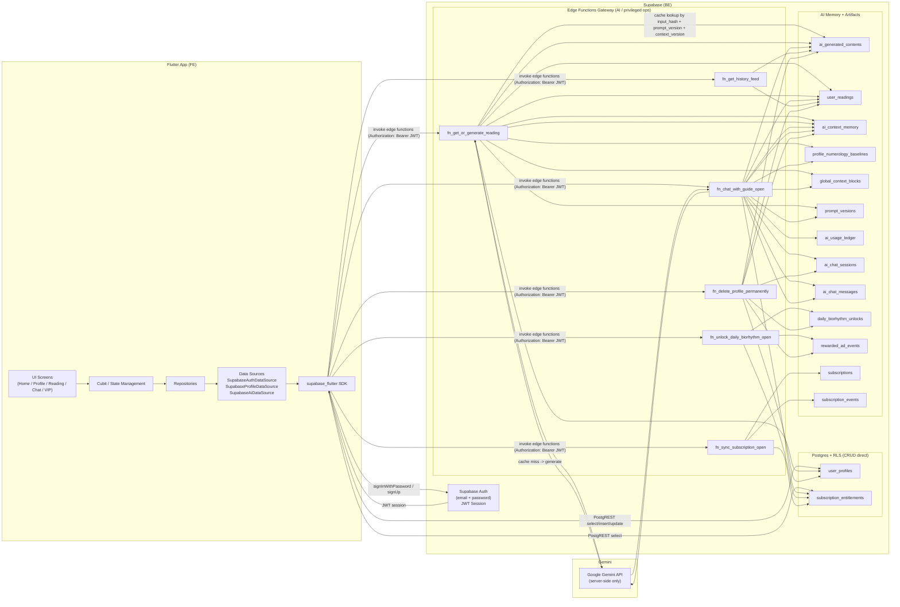
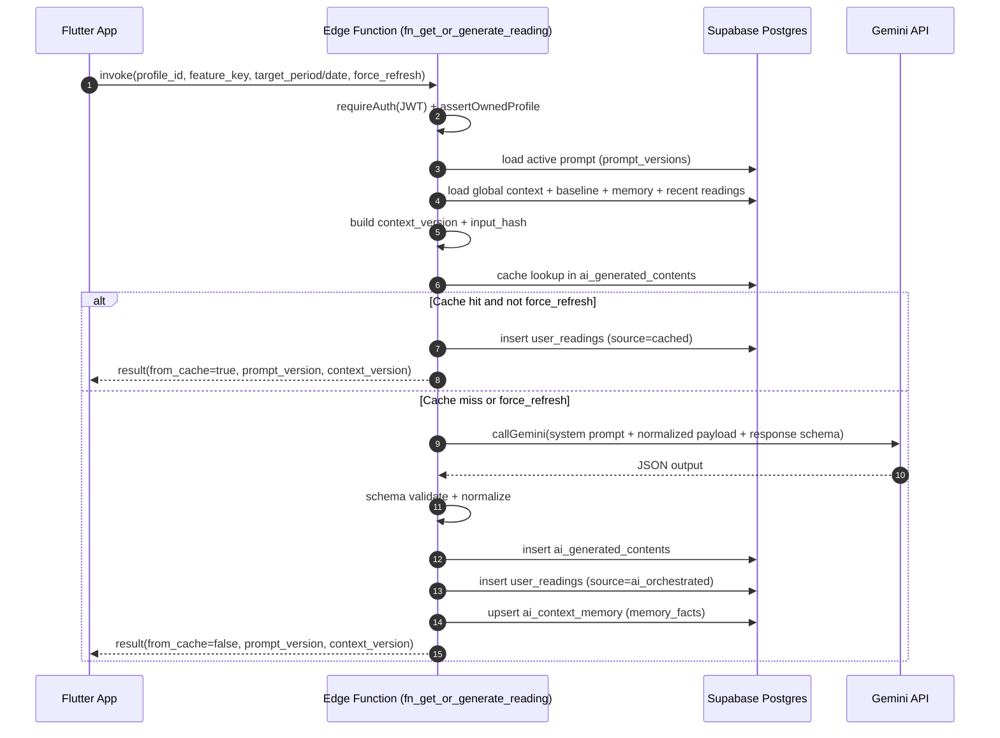

# SoulNum FE -> BE Supabase Flow (CRUD + AI)

```mermaid
flowchart LR
  subgraph FE["Flutter App (FE)"]
    UI["UI Screens\n(Home / Profile / Reading / Chat / VIP)"]
    CUBIT["Cubit / State Management"]
    REPO["Repositories"]
    DS["Data Sources\nSupabaseAuthDataSource\nSupabaseProfileDataSource\nSupabaseAiDataSource"]
    SDK["supabase_flutter SDK"]
    UI --> CUBIT --> REPO --> DS --> SDK
  end

  subgraph SB["Supabase (BE)"]
    AUTH["Supabase Auth\n(email + password)\nJWT Session"]

    subgraph SQL["Postgres + RLS (CRUD direct)"]
      UP["user_profiles"]
      ENT["subscription_entitlements"]
    end

    subgraph EF["Edge Functions Gateway (AI / privileged ops)"]
      FREAD["fn_get_or_generate_reading"]
      FCHAT["fn_chat_with_guide_open"]
      FUNLOCK["fn_unlock_daily_biorhythm_open"]
      FSUB["fn_sync_subscription_open"]
      FHIST["fn_get_history_feed"]
      FDEL["fn_delete_profile_permanently"]
    end

    subgraph MEM["AI Memory + Artifacts"]
      AGC["ai_generated_contents"]
      UR["user_readings"]
      ACM["ai_context_memory"]
      PB["profile_numerology_baselines"]
      GCB["global_context_blocks"]
      PV["prompt_versions"]
      LEDGER["ai_usage_ledger"]
      CHATSESS["ai_chat_sessions"]
      CHATMSG["ai_chat_messages"]
      DBU["daily_biorhythm_unlocks"]
      RAE["rewarded_ad_events"]
      SUBS["subscriptions"]
      SUBEV["subscription_events"]
    end
  end

  subgraph AI["Gemini"]
    GEM["Google Gemini API\n(server-side only)"]
  end

  %% Auth
  SDK -->|"signInWithPassword / signUp"| AUTH
  AUTH -->|"JWT session"| SDK

  %% Direct CRUD
  SDK -->|"PostgREST select/insert/update"| UP
  SDK -->|"PostgREST select"| ENT

  %% Function invocations
  SDK -->|"invoke edge functions (Authorization: Bearer JWT)"| FREAD
  SDK -->|"invoke edge functions (Authorization: Bearer JWT)"| FCHAT
  SDK -->|"invoke edge functions (Authorization: Bearer JWT)"| FUNLOCK
  SDK -->|"invoke edge functions (Authorization: Bearer JWT)"| FSUB
  SDK -->|"invoke edge functions (Authorization: Bearer JWT)"| FHIST
  SDK -->|"invoke edge functions (Authorization: Bearer JWT)"| FDEL

  %% Reading AI flow
  FREAD --> UP
  FREAD --> PV
  FREAD --> GCB
  FREAD --> PB
  FREAD --> ACM
  FREAD --> UR
  FREAD -->|"cache lookup by input_hash + prompt_version + context_version"| AGC
  FREAD -->|"cache miss -> generate"| GEM
  GEM --> FREAD
  FREAD --> AGC
  FREAD --> UR
  FREAD --> ACM

  %% Chat AI flow
  FCHAT --> ENT
  FCHAT --> PV
  FCHAT --> GCB
  FCHAT --> PB
  FCHAT --> ACM
  FCHAT --> UR
  FCHAT --> CHATSESS
  FCHAT --> CHATMSG
  FCHAT --> LEDGER
  FCHAT --> GEM
  GEM --> FCHAT
  FCHAT --> AGC
  FCHAT --> CHATMSG
  FCHAT --> ACM

  %% Daily unlock / subscription / history / deletion
  FUNLOCK --> ENT
  FUNLOCK --> DBU
  FUNLOCK --> RAE
  FSUB --> SUBS
  FSUB --> SUBEV
  FSUB --> ENT
  FHIST --> UR
  FHIST --> AGC
  FDEL --> UP
  FDEL --> CHATSESS
  FDEL --> DBU
  FDEL --> RAE
  FDEL --> ACM
  FDEL --> UR
  FDEL --> AGC

```

```mermaid
sequenceDiagram
  autonumber
  participant App as Flutter App
  participant EF as Edge Function (fn_get_or_generate_reading)
  participant DB as Supabase Postgres
  participant GM as Gemini API

  App->>EF: invoke(profile_id, feature_key, target_period/date, force_refresh)
  EF->>EF: requireAuth(JWT) + assertOwnedProfile
  EF->>DB: load active prompt (prompt_versions)
  EF->>DB: load global context + baseline + memory + recent readings
  EF->>EF: build context_version + input_hash
  EF->>DB: cache lookup in ai_generated_contents

  alt Cache hit and not force_refresh
    EF->>DB: insert user_readings (source=cached)
    EF-->>App: result(from_cache=true, prompt_version, context_version)
  else Cache miss or force_refresh
    EF->>GM: callGemini(system prompt + normalized payload + response schema)
    GM-->>EF: JSON output
    EF->>EF: schema validate + normalize
    EF->>DB: insert ai_generated_contents
    EF->>DB: insert user_readings (source=ai_orchestrated)
    EF->>DB: upsert ai_context_memory (memory_facts)
    EF-->>App: result(from_cache=false, prompt_version, context_version)
  end
```

