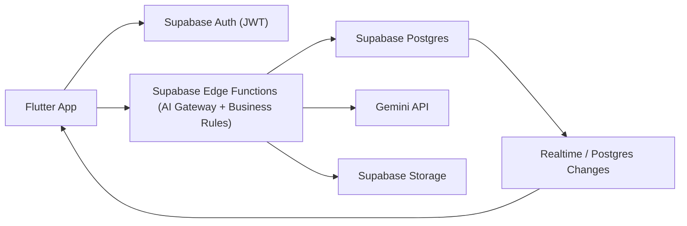

# PHASE 8 – TECHNICAL ARCHITECTURE & BACKEND DESIGN

## 0. Document Metadata
- Product: SoulNum (Vietnam, Numerology-first)
- Date: February 28, 2026
- Platform: Flutter (mobile client)
- Backend: Supabase (Auth, PostgreSQL, Storage, Realtime, Edge Functions)
- AI Layer: Google Gemini API (only via Supabase Edge Functions)
- Scope baseline:
  - `PRD - SoulNum (Vietnam, Numerology-first).md`
  - `PHASE_5_USER_FLOW_DEFINITION.md`
  - `PHASE_7_UI_DESIGN.md`

---

## 1. System Architecture

### 1.1 Architecture Goals
1. AI-first nhưng vẫn kiểm soát chi phí bằng caching + quota.
2. Dữ liệu tạo ra bởi AI phải trở thành memory tái sử dụng xuyên tính năng.
3. Không để Gemini key hoặc prompt logic lộ ra phía Flutter.
4. Bám sát scope monetization:
   - Core numerology free.
   - AI chatbot chỉ VIP Pro + hard limit theo tháng.
   - Chu kỳ sinh học ngày: free cần rewarded ad, VIP mở trực tiếp.
5. Hỗ trợ mở rộng dài hạn (prompt versioning, memory compaction, service tách rời sau này).

### 1.2 High-Level Component Diagram


### 1.3 Client Communication Lifecycle
1. Flutter đăng nhập/khởi tạo session qua Supabase Auth, nhận JWT.
2. Flutter gọi Edge Function cho các nghiệp vụ quan trọng:
   - tạo đọc giải numerology,
   - chat AI,
   - mở khóa chu kỳ sinh học,
   - sync VIP,
   - xóa hồ sơ.
3. Edge Function xác thực JWT, resolve user id, chạy policy logic (VIP/quota/ad-gate/profile-limit).
4. Nếu cần AI:
   - Edge Function lấy context từ PostgreSQL,
   - chọn prompt phiên bản active,
   - gọi Gemini,
   - hậu xử lý output,
   - ghi `ai_generated_contents` + `ai_context_memory`.
5. Edge Function trả response gọn nhẹ cho Flutter.
6. Flutter dùng Realtime/refresh để cập nhật trạng thái quota, subscription, history.

### 1.4 Supabase Responsibilities
1. AuthN/AuthZ: định danh user và phân quyền truy cập row-level.
2. PostgreSQL: nguồn dữ liệu chuẩn (profile, readings, AI memory, quota, subscription).
3. Edge Functions: lớp business + AI gateway an toàn.
4. Storage: lưu artifact khi cần (vd. export report sau này, không bắt buộc MVP).
5. Realtime: đẩy thay đổi entitlement/quota/readings cho trải nghiệm gần real-time.

### 1.5 Edge Function AI Gateway
1. Gemini API key chỉ tồn tại trong Edge Function secrets.
2. Prompt orchestration và guardrail chạy server-side.
3. Output chuẩn hóa về JSON schema trước khi lưu/trả client.
4. Ghi usage/cost/quota atomically để tránh race condition.

### 1.6 AI Generation Lifecycle
1. Nhận request + feature key.
2. Build `input_hash` từ normalized inputs (profile/feature/time/prompt version).
3. Kiểm tra cache nội bộ (`ai_generated_contents`) theo hash + version.
4. Nếu cache hit còn hợp lệ: dùng lại.
5. Nếu cache miss: gọi Gemini.
6. Parse, validate, sanitize output.
7. Persist vào `ai_generated_contents` + mapping vào `user_readings`.
8. Trích memory dài hạn vào `ai_context_memory`.

### 1.7 Context Persistence Strategy
1. `ai_context_memory` là lớp memory bền vững:
   - sở hữu bởi user + profile,
   - có loại memory (`trait`, `goal`, `pattern`, `preference`, `risk_note`),
   - có `confidence_score`, `last_used_at`, `is_active`.
2. `user_readings` lưu dấu vết từng lần người dùng xem insight.
3. `ai_generated_contents` lưu full generation để audit, cache, và tái sử dụng.
4. Chatbot và các module đọc giải cùng đọc chung memory để tăng tính cá nhân hóa dài hạn.

---

## 2. Backend Logical Modules

## 2.1 Authentication Module
- Thành phần:
  - Supabase Auth (`auth.users`)
  - `public.users` (app-level metadata)
- Trách nhiệm:
  - định danh user,
  - bootstrap app user row,
  - làm nguồn ownership cho toàn bộ dữ liệu.
- Tương tác:
  - mọi Edge Function bắt buộc kiểm JWT và map `auth.uid()` -> `users.id`.

## 2.2 User Profile Module
- Thành phần:
  - `user_profiles`
  - `profile_deletion_audits`
- Trách nhiệm:
  - quản lý nhiều hồ sơ theo owner,
  - enforce giới hạn free 2 hồ sơ, VIP unlimited,
  - xóa vĩnh viễn hồ sơ + dữ liệu liên quan.
- Tương tác:
  - dùng bởi toàn bộ module numerology, compatibility, daily cycle, AI chat.

## 2.3 Prompt Orchestration Module
- Thành phần:
  - `prompt_versions`
  - Edge function prompt builder
- Trách nhiệm:
  - version hóa prompt theo từng feature,
  - cho phép rollout an toàn,
  - truy vết prompt nào sinh ra nội dung nào.
- Tương tác:
  - `ai_generated_contents.prompt_version_id` để audit/replay.

## 2.4 Numerology Insight Generation Module
- Thành phần:
  - `user_readings`
  - `ai_generated_contents`
  - Edge function `fn_get_or_generate_reading`
- Trách nhiệm:
  - tạo insight cho core modules,
  - caching/reuse kết quả theo ngữ cảnh,
  - giữ history đọc giải.

## 2.5 AI Context Memory Module
- Thành phần:
  - `ai_context_memory`
  - Edge function memory extractor/compactor
- Trách nhiệm:
  - lưu "facts" rút ra từ reading/chat,
  - cung cấp context cho lần generate tiếp theo,
  - kiểm soát memory phình to bằng decay/compaction.

## 2.6 Reports / Readings Module
- Thành phần:
  - `user_readings`
  - `daily_biorhythm_unlocks`
  - `rewarded_ad_events`
- Trách nhiệm:
  - theo dõi user đã đọc gì, lúc nào,
  - điều phối ad-gate cho chu kỳ sinh học ngày.

## 2.7 History Retrieval Module
- Thành phần:
  - query layer trên `user_readings`, `ai_generated_contents`
- Trách nhiệm:
  - trả danh sách lịch sử đọc giải/chat có phân trang,
  - lọc theo profile/feature/time window.

## 2.8 Subscription & Monetization Module
- Thành phần:
  - `subscriptions`
  - `subscription_entitlements`
  - `subscription_events`
  - `ai_usage_ledger`
- Trách nhiệm:
  - đồng bộ VIP tháng/năm,
  - kiểm hard limit chat theo tháng,
  - lưu usage để kiểm soát biên lợi nhuận AI.

---

## 3. Database Design (Supabase PostgreSQL)

## 3.1 Design Principles
1. Mọi dữ liệu người dùng thuộc quyền sở hữu trực tiếp của `users.id`.
2. Bảng AI được tách rõ:
   - generation artifact,
   - memory facts,
   - usage/quota.
3. Hỗ trợ audit và rollback prompt bằng `prompt_versions`.
4. Dễ mở rộng bằng JSONB có kiểm soát + index trọng yếu.

## 3.2 Table Overview
1. `users`
2. `user_profiles`
3. `prompt_versions`
4. `ai_generated_contents`
5. `user_readings`
6. `ai_context_memory`
7. `ai_chat_sessions`
8. `ai_chat_messages`
9. `ai_usage_ledger`
10. `subscriptions`
11. `subscription_entitlements`
12. `subscription_events`
13. `rewarded_ad_events`
14. `daily_biorhythm_unlocks`
15. `profile_deletion_audits`

## 3.3 Detailed Table Specifications

### 3.3.1 `users`
- Related feature: Authentication, ownership root cho mọi dữ liệu.
- Table purpose: mirror app-specific metadata từ `auth.users`.
- Why exists: tránh phụ thuộc trực tiếp mọi truy vấn vào schema `auth`.
- Data ownership: mỗi row do chính user sở hữu (`id = auth.uid()`).
- Relationships:
  - 1:N với `user_profiles`
  - 1:N với `user_readings`
  - 1:N với `ai_generated_contents`
  - 1:N với `subscriptions`
- Example data:
  - `{id: "f8f7...", locale: "vi-VN", timezone: "Asia/Ho_Chi_Minh", created_at: "..."}`
- Future extensibility:
  - thêm preference chung (notification, consent flags, privacy settings).

### 3.3.2 `user_profiles`
- Related feature: multi-profile, compatibility, all reading modules.
- Table purpose: lưu hồ sơ numerology (họ tên + ngày sinh).
- Why exists: 1 user có nhiều hồ sơ (free 2, VIP unlimited).
- Data ownership: owner là `owner_user_id`.
- Relationships:
  - N:1 `users`
  - 1:N `user_readings`
  - 1:N `ai_context_memory`
  - 1:N `daily_biorhythm_unlocks`
- Example data:
  - `{id:"p1", owner_user_id:"u1", full_name:"Nguyen Van A", birth_date:"1998-03-12", is_active:true}`
- Future extensibility:
  - thêm trường quan hệ (self/family/friend), ghi chú profile.

### 3.3.3 `prompt_versions`
- Related feature: AI prompt orchestration cho mọi module AI.
- Table purpose: version control prompt theo feature.
- Why exists: rollback prompt, A/B an toàn, audit output.
- Data ownership: platform-owned (chỉ admin/service role ghi).
- Relationships:
  - 1:N với `ai_generated_contents`
- Example data:
  - `{id:12, feature_key:"core_numbers", version:"v1.3.0", is_active:true, prompt_template:"..."}`
- Future extensibility:
  - thêm model routing (`gemini-2.5-pro`, `gemini-2.5-flash`), safety policy profile.

### 3.3.4 `ai_generated_contents`
- Related feature: numerology insights, chatbot answer caching, history.
- Table purpose: lưu artifact sinh bởi Gemini.
- Why exists: reuse output, audit, cost tracking.
- Data ownership: user-owned nếu có `user_id`, platform-owned cho template/global seeds.
- Relationships:
  - N:1 `users`
  - N:1 `user_profiles`
  - N:1 `prompt_versions`
  - 1:N `user_readings`
  - 1:N `ai_chat_messages`
- Example data:
  - `{id:"g1", user_id:"u1", profile_id:"p1", feature_key:"psych_matrix", input_hash:"sha256...", output_json:{...}}`
- Future extensibility:
  - thêm embeddings/vector ref khi cần semantic retrieval.

### 3.3.5 `user_readings`
- Related feature: toàn bộ các màn phân tích + history + compatibility + daily forecast.
- Table purpose: record mỗi lần user xem kết quả theo profile/feature/time.
- Why exists: tracking hành vi, retention analytics, history retrieval.
- Data ownership: user-owned.
- Relationships:
  - N:1 `users`
  - N:1 `user_profiles`
  - N:1 `ai_generated_contents` (nullable khi reading thuần deterministic)
  - self optional relation qua `secondary_profile_id` cho compatibility.
- Example data:
  - `{id:"r1", user_id:"u1", profile_id:"p1", feature_key:"daily_cycle", target_date:"2026-02-28"}`
- Future extensibility:
  - thêm engagement signals (saved/shared) không ảnh hưởng core schema.

### 3.3.6 `ai_context_memory`
- Related feature: personalization dài hạn cho reading + chatbot.
- Table purpose: lưu memory facts trích xuất từ lịch sử.
- Why exists: giảm lặp thông tin, tăng chiều sâu hội thoại.
- Data ownership: user-owned, profile-scoped.
- Relationships:
  - N:1 `users`
  - N:1 `user_profiles`
  - N:1 `ai_generated_contents` (memory source)
- Example data:
  - `{memory_key:"personal_goal", memory_value:{"text":"muon cai thien su nghiep"}, confidence_score:0.78}`
- Future extensibility:
  - thêm decay policy / archival table cho memory cũ.

### 3.3.7 `ai_chat_sessions`
- Related feature: VIP Pro chatbot.
- Table purpose: grouping chat conversation theo profile.
- Why exists: quản lý context window + history.
- Data ownership: user-owned.
- Relationships:
  - N:1 `users`
  - N:1 `user_profiles`
  - 1:N `ai_chat_messages`
- Example data:
  - `{id:"s1", user_id:"u1", profile_id:"p1", status:"active"}`
- Future extensibility:
  - thêm session summary để giảm token.

### 3.3.8 `ai_chat_messages`
- Related feature: VIP chatbot transcript.
- Table purpose: lưu từng message user/assistant.
- Why exists: audit, safety review, context replay.
- Data ownership: user-owned.
- Relationships:
  - N:1 `ai_chat_sessions`
  - N:1 `ai_generated_contents` (assistant messages)
- Example data:
  - `{session_id:"s1", role:"user", content:"Hôm nay năng lượng của tôi thế nào?"}`
- Future extensibility:
  - thêm moderation labels / redaction flags.

### 3.3.9 `ai_usage_ledger`
- Related feature: hard limit chat/tháng, unit economics.
- Table purpose: counter usage theo tháng và theo loại.
- Why exists: enforce quota server-side atomically.
- Data ownership: user-owned.
- Relationships:
  - N:1 `users`
  - optional refs tới `ai_chat_messages` hoặc `user_readings`.
- Example data:
  - `{user_id:"u1", usage_month:"2026-02-01", usage_type:"chat_turn", quota_limit:200, used_count:57}`
- Future extensibility:
  - thêm cost attribution chi tiết theo model/provider.

### 3.3.10 `subscriptions`
- Related feature: VIP Pro monthly/yearly.
- Table purpose: lưu trạng thái subscription chuẩn hóa từ Store.
- Why exists: nguồn sự thật cho billing state lifecycle.
- Data ownership: user-owned (transaction events do system ghi).
- Relationships:
  - N:1 `users`
  - 1:N `subscription_events`
  - 1:1 active snapshot với `subscription_entitlements`
- Example data:
  - `{provider:"apple", plan_code:"vip_pro_yearly", status:"active", current_period_end:"2027-02-28"}`
- Future extensibility:
  - hỗ trợ nhiều package VIP hoặc thị trường mới.

### 3.3.11 `subscription_entitlements`
- Related feature: khóa/mở VIP, bypass ad-gate, profile limit, chatbot access.
- Table purpose: entitlement snapshot để check nhanh runtime.
- Why exists: tránh join phức tạp khi check quyền mỗi request.
- Data ownership: user-owned, cập nhật bởi backend sync.
- Relationships:
  - 1:1 `users`
  - derived from `subscriptions`.
- Example data:
  - `{user_id:"u1", is_vip_pro:true, profile_limit:null, chatbot_monthly_limit:200}`
- Future extensibility:
  - thêm entitlement flag riêng theo gói.

### 3.3.12 `subscription_events`
- Related feature: billing audit.
- Table purpose: event log từ App Store/Play Store + manual sync.
- Why exists: truy vết lỗi thanh toán/trạng thái pending.
- Data ownership: system-owned (liên kết user).
- Relationships:
  - N:1 `subscriptions`
  - N:1 `users`
- Example data:
  - `{event_type:"renewed", raw_payload:{...}, occurred_at:"..."}`
- Future extensibility:
  - hỗ trợ fraud detection pipeline.

### 3.3.13 `rewarded_ad_events`
- Related feature: free unlock chu kỳ sinh học ngày.
- Table purpose: ghi nhận ad lifecycle và completion.
- Why exists: chống gian lận unlock và phân tích ad funnel.
- Data ownership: user-owned.
- Relationships:
  - N:1 `users`
  - N:1 `user_profiles`
  - 1:0..1 `daily_biorhythm_unlocks`
- Example data:
  - `{placement:"daily_cycle_unlock", network:"admob", status:"completed"}`
- Future extensibility:
  - thêm mediation metadata.

### 3.3.14 `daily_biorhythm_unlocks`
- Related feature: daily cycle access control.
- Table purpose: đánh dấu user/profile đã mở khóa nội dung ngày nào.
- Why exists: enforce "mỗi ngày mở khóa" và idempotency.
- Data ownership: user-owned.
- Relationships:
  - N:1 `users`
  - N:1 `user_profiles`
  - N:1 `rewarded_ad_events` (nullable với VIP unlock).
- Example data:
  - `{user_id:"u1", profile_id:"p1", unlock_date:"2026-02-28", unlock_method:"rewarded_ad"}`
- Future extensibility:
  - hỗ trợ rule unlock theo timezone linh hoạt.

### 3.3.15 `profile_deletion_audits`
- Related feature: xóa vĩnh viễn hồ sơ trong app.
- Table purpose: audit không chứa PII để chứng minh thao tác xóa.
- Why exists: phục vụ kiểm soát vận hành/compliance nội bộ.
- Data ownership: system-owned, tham chiếu user.
- Relationships:
  - N:1 `users`
- Example data:
  - `{user_id:"u1", deleted_profile_id:"p1", deleted_at:"..."}`
- Future extensibility:
  - thêm actor/source (self-service, support-tool).

## 3.4 SQL Schema (Developer-Readable with Inline Comments)
```sql
-- Enable extension for UUID generation if not already enabled.
create extension if not exists "pgcrypto";

-- 1) App-level users (mirror of auth.users with app metadata).
create table if not exists public.users (
  id uuid primary key references auth.users(id) on delete cascade, -- ownership root
  locale text not null default 'vi-VN', -- MVP locale
  timezone text not null default 'Asia/Ho_Chi_Minh', -- used for daily-cycle boundaries
  created_at timestamptz not null default now(),
  updated_at timestamptz not null default now()
);
comment on table public.users is 'Application-level user metadata; all user-owned data references this table.';
comment on column public.users.id is 'Same UUID as auth.users.id.';

-- 2) Numerology profiles (self/family/friend) under one account.
create table if not exists public.user_profiles (
  id uuid primary key default gen_random_uuid(),
  owner_user_id uuid not null references public.users(id) on delete cascade, -- who owns this profile
  full_name text not null, -- required for all numerology calculations
  birth_date date not null, -- required for all numerology calculations
  gender text null,
  relation_label text null, -- self/family/friend (optional metadata)
  is_active boolean not null default false, -- current profile in use
  created_at timestamptz not null default now(),
  updated_at timestamptz not null default now(),
  deleted_at timestamptz null
);
comment on table public.user_profiles is 'Stores numerology profiles owned by an authenticated user.';
create index if not exists idx_user_profiles_owner on public.user_profiles(owner_user_id);
create index if not exists idx_user_profiles_active on public.user_profiles(owner_user_id, is_active) where deleted_at is null;

-- 3) Prompt version catalog for reproducible AI behavior.
create table if not exists public.prompt_versions (
  id bigserial primary key,
  feature_key text not null, -- core_numbers, psych_matrix, chat_assistant, daily_cycle, etc.
  version text not null, -- semantic version identifier
  model_name text not null, -- gemini model chosen for this prompt
  prompt_template text not null, -- full server-side template (never exposed to client)
  response_schema jsonb null, -- expected JSON structure for validation
  is_active boolean not null default false,
  created_by uuid null references public.users(id),
  created_at timestamptz not null default now(),
  unique(feature_key, version)
);
comment on table public.prompt_versions is 'Versioned prompts used by Edge Functions for deterministic AI orchestration.';
create index if not exists idx_prompt_versions_feature_active on public.prompt_versions(feature_key, is_active);

-- 4) Raw/generated AI artifacts reused across features.
create table if not exists public.ai_generated_contents (
  id uuid primary key default gen_random_uuid(),
  user_id uuid null references public.users(id) on delete cascade, -- null allowed for platform-generated shared content
  profile_id uuid null references public.user_profiles(id) on delete cascade,
  feature_key text not null,
  prompt_version_id bigint not null references public.prompt_versions(id),
  input_hash text not null, -- dedupe/cache key based on normalized input + prompt version
  output_text text null, -- raw text (if needed)
  output_json jsonb not null, -- normalized content payload for app consumption
  token_input integer null,
  token_output integer null,
  estimated_cost_usd numeric(12,6) null,
  safety_labels jsonb null, -- moderation/safety metadata
  generated_at timestamptz not null default now(),
  expires_at timestamptz null
);
comment on table public.ai_generated_contents is 'Stores Gemini-generated outputs for caching, audit, and history reuse.';
create index if not exists idx_ai_generated_user_feature on public.ai_generated_contents(user_id, feature_key, generated_at desc);
create index if not exists idx_ai_generated_hash on public.ai_generated_contents(feature_key, prompt_version_id, input_hash);

-- 5) User-visible reading records (history backbone).
create table if not exists public.user_readings (
  id uuid primary key default gen_random_uuid(),
  user_id uuid not null references public.users(id) on delete cascade,
  profile_id uuid not null references public.user_profiles(id) on delete cascade,
  secondary_profile_id uuid null references public.user_profiles(id) on delete set null, -- compatibility feature
  feature_key text not null, -- core_numbers, psych_matrix, biorhythm_daily, forecast_month, etc.
  period_key text null, -- YYYY-MM-DD / YYYY-MM / YYYY for prediction scopes
  target_date date null, -- daily-cycle and day forecast queries
  ai_content_id uuid null references public.ai_generated_contents(id) on delete set null,
  result_snapshot jsonb not null, -- deterministic values + selected AI summary for fast load
  source_type text not null default 'ai_orchestrated', -- deterministic | ai_orchestrated | cached
  created_at timestamptz not null default now()
);
comment on table public.user_readings is 'Tracks each reading retrieval for history, analytics, and memory extraction.';
create index if not exists idx_user_readings_user_created on public.user_readings(user_id, created_at desc);
create index if not exists idx_user_readings_profile_feature on public.user_readings(profile_id, feature_key, created_at desc);

-- 6) Long-term AI memory facts for personalization.
create table if not exists public.ai_context_memory (
  id uuid primary key default gen_random_uuid(),
  user_id uuid not null references public.users(id) on delete cascade,
  profile_id uuid null references public.user_profiles(id) on delete cascade,
  memory_type text not null, -- trait | goal | pattern | preference | risk_note
  memory_key text not null, -- stable identifier (e.g., career_focus)
  memory_value jsonb not null, -- structured value
  confidence_score numeric(4,3) not null default 0.5,
  source_content_id uuid null references public.ai_generated_contents(id) on delete set null,
  source_reading_id uuid null references public.user_readings(id) on delete set null,
  is_active boolean not null default true,
  last_used_at timestamptz null,
  created_at timestamptz not null default now(),
  updated_at timestamptz not null default now(),
  unique(user_id, profile_id, memory_type, memory_key)
);
comment on table public.ai_context_memory is 'Persistent reusable memory extracted from readings/chats for cross-feature personalization.';
create index if not exists idx_ai_memory_user_profile on public.ai_context_memory(user_id, profile_id, is_active);
create index if not exists idx_ai_memory_last_used on public.ai_context_memory(user_id, last_used_at desc);

-- 7) Chat session containers (VIP only).
create table if not exists public.ai_chat_sessions (
  id uuid primary key default gen_random_uuid(),
  user_id uuid not null references public.users(id) on delete cascade,
  profile_id uuid not null references public.user_profiles(id) on delete cascade,
  status text not null default 'active', -- active | closed
  started_at timestamptz not null default now(),
  ended_at timestamptz null
);
comment on table public.ai_chat_sessions is 'Conversation grouping for VIP chatbot interactions per profile.';
create index if not exists idx_ai_chat_sessions_user on public.ai_chat_sessions(user_id, started_at desc);

-- 8) Chat message transcript rows.
create table if not exists public.ai_chat_messages (
  id uuid primary key default gen_random_uuid(),
  session_id uuid not null references public.ai_chat_sessions(id) on delete cascade,
  user_id uuid not null references public.users(id) on delete cascade,
  role text not null, -- user | assistant | system
  content text not null,
  ai_content_id uuid null references public.ai_generated_contents(id) on delete set null, -- assistant response linkage
  token_input integer null,
  token_output integer null,
  created_at timestamptz not null default now()
);
comment on table public.ai_chat_messages is 'Stores raw chat transcript for context replay, safety, and support audit.';
create index if not exists idx_ai_chat_messages_session on public.ai_chat_messages(session_id, created_at asc);

-- 9) Usage counters for hard quota + cost control.
create table if not exists public.ai_usage_ledger (
  id uuid primary key default gen_random_uuid(),
  user_id uuid not null references public.users(id) on delete cascade,
  usage_month date not null, -- first day of month (YYYY-MM-01)
  usage_type text not null, -- chat_turn | ai_reading_generation
  quota_limit integer not null, -- resolved from entitlement at time of request
  used_count integer not null default 0,
  blocked_count integer not null default 0,
  estimated_cost_usd numeric(12,6) not null default 0,
  updated_at timestamptz not null default now(),
  unique(user_id, usage_month, usage_type)
);
comment on table public.ai_usage_ledger is 'Atomic per-month counters used to enforce VIP chatbot hard limit and monitor AI economics.';
create index if not exists idx_ai_usage_user_month on public.ai_usage_ledger(user_id, usage_month desc);

-- 10) Subscription contract state.
create table if not exists public.subscriptions (
  id uuid primary key default gen_random_uuid(),
  user_id uuid not null references public.users(id) on delete cascade,
  provider text not null, -- apple | google
  provider_original_tx_id text not null,
  plan_code text not null, -- vip_pro_monthly | vip_pro_yearly
  status text not null, -- active | grace_period | canceled | expired | pending
  current_period_start timestamptz not null,
  current_period_end timestamptz not null,
  auto_renew boolean not null default true,
  last_verified_at timestamptz not null default now(),
  created_at timestamptz not null default now(),
  updated_at timestamptz not null default now(),
  unique(provider, provider_original_tx_id)
);
comment on table public.subscriptions is 'Normalized subscription lifecycle records from app stores.';
create index if not exists idx_subscriptions_user_status on public.subscriptions(user_id, status, current_period_end desc);

-- 11) Fast entitlement snapshot for runtime checks.
create table if not exists public.subscription_entitlements (
  user_id uuid primary key references public.users(id) on delete cascade,
  is_vip_pro boolean not null default false,
  plan_code text null, -- vip_pro_monthly | vip_pro_yearly
  entitle_start_at timestamptz null,
  entitle_end_at timestamptz null,
  profile_limit integer null, -- null means unlimited
  chatbot_monthly_limit integer not null default 0,
  ad_free_daily_cycle boolean not null default false, -- VIP bypass for daily ad-gate
  updated_at timestamptz not null default now()
);
comment on table public.subscription_entitlements is 'Current effective rights used by every gated Edge Function.';

-- 12) Subscription webhook/sync audit trail.
create table if not exists public.subscription_events (
  id uuid primary key default gen_random_uuid(),
  subscription_id uuid null references public.subscriptions(id) on delete set null,
  user_id uuid not null references public.users(id) on delete cascade,
  provider text not null,
  event_type text not null, -- purchased | renewed | billing_retry | expired | revoked
  event_time timestamptz not null,
  raw_payload jsonb not null, -- kept for forensic analysis
  created_at timestamptz not null default now()
);
comment on table public.subscription_events is 'Immutable billing event log for troubleshooting and compliance.';
create index if not exists idx_subscription_events_user_time on public.subscription_events(user_id, event_time desc);

-- 13) Rewarded ad lifecycle events for daily unlock gate.
create table if not exists public.rewarded_ad_events (
  id uuid primary key default gen_random_uuid(),
  user_id uuid not null references public.users(id) on delete cascade,
  profile_id uuid not null references public.user_profiles(id) on delete cascade,
  placement text not null, -- daily_cycle_unlock
  ad_network text not null, -- admob, applovin, etc.
  ad_unit_id text null,
  status text not null, -- started | completed | failed | canceled
  provider_reward_id text null, -- callback id if available
  occurred_at timestamptz not null default now(),
  metadata jsonb null
);
comment on table public.rewarded_ad_events is 'Tracks ad verification and completion used for free-tier daily cycle access.';
create index if not exists idx_rewarded_events_user_profile_date on public.rewarded_ad_events(user_id, profile_id, occurred_at desc);

-- 14) Daily biorhythm unlock ledger (idempotent per day).
create table if not exists public.daily_biorhythm_unlocks (
  id uuid primary key default gen_random_uuid(),
  user_id uuid not null references public.users(id) on delete cascade,
  profile_id uuid not null references public.user_profiles(id) on delete cascade,
  unlock_date date not null, -- date boundary in user's timezone
  unlock_method text not null, -- vip | rewarded_ad
  ad_event_id uuid null references public.rewarded_ad_events(id) on delete set null,
  created_at timestamptz not null default now(),
  unique(user_id, profile_id, unlock_date)
);
comment on table public.daily_biorhythm_unlocks is 'Guarantees one unlock record per profile/day to enforce ad gate logic.';
create index if not exists idx_daily_unlock_user_date on public.daily_biorhythm_unlocks(user_id, unlock_date desc);

-- 15) PII-safe audit for permanent deletion operations.
create table if not exists public.profile_deletion_audits (
  id uuid primary key default gen_random_uuid(),
  user_id uuid not null references public.users(id) on delete cascade,
  deleted_profile_id uuid not null, -- UUID reference only, no personal fields retained
  deleted_at timestamptz not null default now(),
  reason text not null default 'user_requested'
);
comment on table public.profile_deletion_audits is 'Non-PII audit proof that profile deletion was executed.';
create index if not exists idx_profile_deletion_audits_user on public.profile_deletion_audits(user_id, deleted_at desc);
```

## 3.5 RLS Strategy (Core Policies)
```sql
-- Enable RLS for all user-owned tables.
alter table public.users enable row level security;
alter table public.user_profiles enable row level security;
alter table public.ai_generated_contents enable row level security;
alter table public.user_readings enable row level security;
alter table public.ai_context_memory enable row level security;
alter table public.ai_chat_sessions enable row level security;
alter table public.ai_chat_messages enable row level security;
alter table public.ai_usage_ledger enable row level security;
alter table public.subscriptions enable row level security;
alter table public.subscription_entitlements enable row level security;
alter table public.subscription_events enable row level security;
alter table public.rewarded_ad_events enable row level security;
alter table public.daily_biorhythm_unlocks enable row level security;
alter table public.profile_deletion_audits enable row level security;

-- Example policy pattern (repeat with table-specific owner columns).
create policy "users_can_select_own_profiles"
on public.user_profiles
for select using (owner_user_id = auth.uid());

create policy "users_can_insert_own_profiles"
on public.user_profiles
for insert with check (owner_user_id = auth.uid());

create policy "users_can_update_own_profiles"
on public.user_profiles
for update using (owner_user_id = auth.uid())
with check (owner_user_id = auth.uid());

create policy "users_can_delete_own_profiles"
on public.user_profiles
for delete using (owner_user_id = auth.uid());
```

Lưu ý triển khai:
1. `prompt_versions` chỉ cho service role/admin (không mở cho user thường).
2. Các thao tác nhạy cảm (quota increment, entitlement update, subscription sync) đi qua Edge Function dùng service role, không cho client thao tác trực tiếp.

---

## 4. AI Invocation & Edge Function Design

## 4.1 Function Catalog
1. `fn_get_or_generate_reading`
2. `fn_chat_with_guide`
3. `fn_unlock_daily_biorhythm`
4. `fn_sync_subscription`
5. `fn_delete_profile_permanently`
6. `fn_get_history_feed`
7. `fn_compact_context_memory` (scheduled maintenance)

## 4.2 Function Details

### 4.2.1 `fn_get_or_generate_reading`
- Triggering user action:
  - mở các mục: con số cốt lõi, ma trận tâm lý, biểu đồ ngày sinh, năng lượng gia tăng, 4 đỉnh cao, 4 thử thách, dự đoán ngày/tháng/năm, chỉ số tương hợp.
- Purpose:
  - trả kết quả reading nhanh bằng cache nếu có; generate mới nếu thiếu.
- Input payload:
```json
{
  "profile_id": "uuid",
  "feature_key": "core_numbers|psych_matrix|birth_chart|energy_boost|four_peaks|four_challenges|forecast_day|forecast_month|forecast_year|compatibility",
  "target_period": "2026-02-28|2026-02|2026",
  "secondary_profile_id": "uuid|null",
  "force_refresh": false
}
```
- Context retrieval logic:
  - load profile chính (và profile phụ nếu compatibility),
  - load memory active từ `ai_context_memory`,
  - load prompt active từ `prompt_versions`,
  - check cache bằng `input_hash`.
- Gemini prompt usage:
  - system prompt cố định theo `feature_key`,
  - user prompt gồm deterministic numerology values + memory context rút gọn.
- Persistence behavior:
  - cache miss -> insert `ai_generated_contents`,
  - luôn insert `user_readings`,
  - upsert memory facts vào `ai_context_memory`.
- Response structure:
```json
{
  "reading_id": "uuid",
  "feature_key": "core_numbers",
  "from_cache": true,
  "result": {},
  "generated_at": "2026-02-28T12:00:00Z"
}
```

### 4.2.2 `fn_chat_with_guide`
- Triggering user action:
  - VIP user gửi 1 tin nhắn trong AI chatbot.
- Purpose:
  - trả lời chatbot cá nhân hóa + enforce hard limit/tháng.
- Input payload:
```json
{
  "profile_id": "uuid",
  "session_id": "uuid|null",
  "message": "string"
}
```
- Context retrieval logic:
  - check entitlement `is_vip_pro`,
  - đọc `chatbot_monthly_limit`,
  - transaction lock row `ai_usage_ledger` để check quota,
  - lấy recent chat messages + memory + recent readings.
- Gemini prompt usage:
  - prompt `feature_key = chat_assistant`,
  - ghép context rút gọn (top memory + last N turns + key readings).
- Persistence behavior:
  - insert user message và assistant message,
  - insert `ai_generated_contents` cho assistant answer,
  - increment `ai_usage_ledger.used_count`,
  - nếu vượt limit: tăng `blocked_count`, không gọi Gemini.
- Response structure:
```json
{
  "session_id": "uuid",
  "reply": "string",
  "remaining_quota": 142,
  "quota_limit": 200,
  "quota_exhausted": false
}
```

### 4.2.3 `fn_unlock_daily_biorhythm`
- Triggering user action:
  - user nhấn xem chu kỳ sinh học ngày.
- Purpose:
  - mở khóa nội dung ngày theo rule VIP/ad-gate.
- Input payload:
```json
{
  "profile_id": "uuid",
  "unlock_date": "2026-02-28",
  "ad_proof": {
    "network": "admob",
    "reward_id": "abc123",
    "status": "completed"
  }
}
```
- Context retrieval logic:
  - check entitlement VIP,
  - query `daily_biorhythm_unlocks` idempotent theo (user, profile, date),
  - nếu free: verify ad proof và ghi `rewarded_ad_events`.
- Gemini prompt usage:
  - sau khi unlock thành công, gọi nội bộ flow reading với `feature_key=biorhythm_daily` (hoặc trả token để client gọi reading ngay sau đó).
- Persistence behavior:
  - insert `daily_biorhythm_unlocks`,
  - free path insert `rewarded_ad_events`.
- Response structure:
```json
{
  "unlocked": true,
  "unlock_method": "rewarded_ad",
  "reading_access_token": "opaque_token_or_null"
}
```

### 4.2.4 `fn_sync_subscription`
- Triggering user action:
  - sau purchase/restore, mở app lại, hoặc manual refresh billing.
- Purpose:
  - xác thực receipt/token store và cập nhật quyền VIP.
- Input payload:
```json
{
  "provider": "apple|google",
  "receipt_or_purchase_token": "string",
  "plan_code": "vip_pro_monthly|vip_pro_yearly"
}
```
- Context retrieval logic:
  - verify với store API ở server side,
  - reconcile với `subscriptions` hiện có.
- Gemini prompt usage:
  - không dùng Gemini.
- Persistence behavior:
  - upsert `subscriptions`,
  - append `subscription_events`,
  - upsert `subscription_entitlements` (`is_vip_pro`, `profile_limit=null`, `ad_free_daily_cycle=true`, `chatbot_monthly_limit`).
- Response structure:
```json
{
  "is_vip_pro": true,
  "plan_code": "vip_pro_monthly",
  "entitle_end_at": "2026-03-28T00:00:00Z"
}
```

### 4.2.5 `fn_delete_profile_permanently`
- Triggering user action:
  - user xác nhận xóa hồ sơ vĩnh viễn trong app.
- Purpose:
  - xóa hồ sơ + dữ liệu liên quan theo scope profile.
- Input payload:
```json
{
  "profile_id": "uuid",
  "confirm": true
}
```
- Context retrieval logic:
  - verify ownership profile,
  - lock profile row để tránh race với reading/chat request.
- Gemini prompt usage:
  - không dùng Gemini.
- Persistence behavior:
  - transaction delete các bản ghi phụ thuộc profile (`user_readings`, `ai_context_memory`, chat session/messages, unlock logs, ad events),
  - delete `user_profiles`,
  - insert `profile_deletion_audits` (không chứa PII).
- Response structure:
```json
{
  "deleted": true,
  "deleted_profile_id": "uuid",
  "remaining_profiles": 1
}
```

### 4.2.6 `fn_get_history_feed`
- Triggering user action:
  - mở màn hình lịch sử đọc giải/chat.
- Purpose:
  - trả feed lịch sử phân trang cho profile hiện tại hoặc toàn account.
- Input payload:
```json
{
  "profile_id": "uuid|null",
  "cursor": "opaque|null",
  "limit": 20
}
```
- Context retrieval logic:
  - query `user_readings` + join `ai_generated_contents` summary.
- Gemini prompt usage:
  - không dùng Gemini.
- Persistence behavior:
  - read-only.
- Response structure:
```json
{
  "items": [],
  "next_cursor": "opaque|null"
}
```

### 4.2.7 `fn_compact_context_memory` (cron)
- Triggering user action:
  - scheduled (ví dụ nightly), không do UI trigger trực tiếp.
- Purpose:
  - gộp memory cũ, deactivate memory trùng/lỗi thời.
- Input payload:
```json
{
  "batch_size": 500
}
```
- Context retrieval logic:
  - chọn memory `last_used_at` cũ + confidence thấp.
- Gemini prompt usage:
  - optional: dùng Gemini tóm lược memory bundle nếu cần.
- Persistence behavior:
  - update `is_active`, insert memory summary mới.
- Response structure:
```json
{
  "processed_users": 120,
  "memories_archived": 830
}
```

---

## 5. Data Flow Mapping

## 5.1 Standard AI Reading Flow
1. User Action:
   - user mở 1 module numerology.
2. Context Fetch:
   - Edge Function lấy profile, memory, prompt active, entitlement.
3. Prompt Construction:
   - build prompt với deterministic numerology values + memory snippets.
4. Gemini Generation:
   - gọi Gemini qua server key.
5. Post-processing:
   - parse JSON, validate schema, sanitize output.
6. Database Persistence:
   - ghi `ai_generated_contents`, `user_readings`, upsert `ai_context_memory`.
7. Client Response:
   - trả payload gọn cho Flutter.

## 5.2 VIP Chat Flow with Hard Limit
1. User Action:
   - gửi message chat.
2. Context Fetch:
   - check VIP + quota month.
3. Prompt Construction:
   - recent turns + memory + readings gần nhất.
4. Gemini Generation:
   - chỉ chạy khi quota còn.
5. Post-processing:
   - sanitize answer, enforce safety.
6. Database Persistence:
   - ghi transcript + usage ledger + generated content.
7. Client Response:
   - trả reply + remaining quota.

## 5.3 Daily Biorhythm Unlock Flow
1. User Action:
   - free user muốn xem chu kỳ ngày.
2. Context Fetch:
   - check entitlement + unlock hiện tại.
3. Gate Decision:
   - VIP: bypass ad.
   - Free: verify rewarded ad completed.
4. Persistence:
   - insert `daily_biorhythm_unlocks` (+ ad event cho free).
5. Reading Generation:
   - gọi flow reading cho `biorhythm_daily`.
6. Client Response:
   - trả nội dung ngày.

## 5.4 Cross-Feature Memory Reuse
1. Reading module sinh memory facts (vd. mục tiêu, điểm dễ stress).
2. Memory facts lưu ở `ai_context_memory`.
3. Chatbot đọc memory đó để trả lời có continuity.
4. Chatbot sinh insight mới, lại ghi vào memory.
5. Lần xem dự đoán tiếp theo dùng memory đã tích lũy để cá nhân hóa sâu hơn.

---

## 6. Scalability & Performance Strategy

## 6.1 AI Caching Opportunities
1. Cache theo `feature_key + prompt_version_id + input_hash`.
2. TTL theo loại:
   - `core_numbers`, `psych_matrix`, `birth_chart`: TTL dài (nhiều tháng) vì dữ liệu tĩnh theo profile.
   - `daily`/`forecast_day`: TTL theo ngày.
   - `forecast_month/year`: TTL theo kỳ.
3. Chat không cache toàn cục, chỉ tái sử dụng context tóm tắt.

## 6.2 Async Processing
1. Trả kết quả đồng bộ cho request chính nếu dưới ngưỡng latency.
2. Hậu xử lý nặng (memory compaction, analytics rollup) chạy async qua scheduled functions.
3. Retry/backoff cho Gemini timeout bằng server logic.

## 6.3 Prompt Versioning
1. Mỗi feature bắt buộc có prompt version active.
2. Rollout theo version mới nhưng vẫn giữ version cũ để rollback.
3. So sánh chất lượng/cost theo version qua `ai_generated_contents`.

## 6.4 Database Indexing
1. Index theo owner + thời gian cho history (`user_readings`, `ai_chat_messages`).
2. Index hash cho cache hit nhanh (`ai_generated_contents`).
3. Unique composite cho unlock idempotent (`daily_biorhythm_unlocks`).
4. Unique per user-month cho quota atomic (`ai_usage_ledger`).

## 6.5 Growing AI Memory Handling
1. Giới hạn số memory active theo profile (top-K theo confidence + recency).
2. Deactivate memory stale, gộp memory trùng bằng `fn_compact_context_memory`.
3. Chat/retrieval chỉ lấy memory budget cố định để đảm bảo latency.

## 6.6 Future Service Separation
1. Khi scale lớn:
   - tách AI Orchestrator thành service riêng,
   - giữ Supabase cho auth/data,
   - dùng queue chuyên dụng cho AI jobs.
2. Không thay đổi contract Flutter:
   - Flutter vẫn chỉ gọi Edge Function endpoint facade.

---

## 7. Security Considerations

## 7.1 Supabase Auth Usage
1. Mọi API nghiệp vụ yêu cầu JWT hợp lệ.
2. User ID suy ra từ token, không tin `user_id` từ client.

## 7.2 Row Level Security (RLS)
1. Toàn bộ bảng user-owned bật RLS.
2. Policy cơ bản:
   - select/insert/update/delete chỉ trên row của chính `auth.uid()`.
3. Bảng hệ thống (`prompt_versions`) chỉ service/admin.

## 7.3 API Key Protection
1. Gemini key lưu trong Supabase Edge Function secrets.
2. Flutter không bao giờ chứa Gemini key.
3. Rotate key định kỳ, audit truy cập function logs.

## 7.4 Edge Function Isolation
1. Function chia theo domain (reading/chat/subscription/delete).
2. Service role chỉ dùng ở block bắt buộc (quota, entitlement, billing sync).
3. Input schema validation strict (Zod/JSON schema) trước khi xử lý.

## 7.5 Prompt Injection Mitigation
1. System prompt tách biệt và bất biến ở server.
2. User message được wrap làm untrusted content.
3. Output bắt buộc parse theo schema; fail thì fallback error chuẩn hóa.
4. Không cho model tự quyết định entitlement/quota/business rules.

## 7.6 Abuse Prevention
1. Rate limit theo user + endpoint (chat/reading).
2. Hard-limit chat per month enforced bằng DB transaction.
3. Ad fraud check:
   - verify reward callback signature/id,
   - reject duplicate reward ids.

## 7.7 Data Protection & Deletion
1. Xóa profile là hard delete dữ liệu liên quan theo profile.
2. Audit deletion chỉ giữ metadata không PII (`profile_deletion_audits`).
3. Mọi truy cập dữ liệu nhạy cảm đều qua RLS + logs.

---

## 8. Operational Notes (MVP)
1. Region: chọn Supabase region gần Việt Nam (Singapore) để giảm latency.
2. Timezone chuẩn user mặc định `Asia/Ho_Chi_Minh` cho daily boundaries.
3. Monitoring:
   - function error rate,
   - p95 latency theo function,
   - Gemini timeout rate,
   - chat quota exhausted rate,
   - ad unlock success rate.
4. Alerting tối thiểu:
   - subscription sync failures,
   - sudden spike blocked_count trong `ai_usage_ledger`,
   - RLS policy violations.

---

## 9. Implementation Sequence (Recommended)
1. Migrations DB + RLS baseline.
2. `fn_sync_subscription` + entitlement checks.
3. `fn_get_or_generate_reading` + caching + prompt_versions.
4. `fn_unlock_daily_biorhythm` + ad verification.
5. `fn_chat_with_guide` + hard limit ledger.
6. `fn_delete_profile_permanently`.
7. History feed + memory compaction cron.

This sequence giữ rủi ro thấp nhất cho MVP vì khóa monetization và access-control trước, rồi mới mở rộng AI depth.

---

## Addendum (2026-03-01) - Gemini PromptOps + Context Warehouse v2

### A1. Implemented Architectural Decisions
1. PromptOps model locked: `Hybrid DB + Git`
   - Runtime active prompt from `public.prompt_versions`.
   - Source-of-truth seed via SQL migration file:
     - [20260301102000_phase10_gemini_context_warehouse.sql](/Users/uranidev/Documents/GitHub/SoulNum/supabase/migrations/20260301102000_phase10_gemini_context_warehouse.sql)
2. Context warehouse locked: `2 layers`
   - Global layer: `public.global_context_blocks`.
   - User/profile layer:
     - deterministic baseline cache: `public.profile_numerology_baselines`,
     - dynamic memory facts: `public.ai_context_memory`.
3. Model policy locked for MVP:
   - `gemini-2.5-flash` for all 12 features.
4. Output contract locked:
   - strict JSON schema per active prompt row (`response_schema` in DB).
5. Security boundary unchanged:
   - Gemini keys remain server-side only (Edge Functions).

### A2. Edge Orchestration Source Updates
Code has been updated in repository:
1. [gemini.ts](/Users/uranidev/Documents/GitHub/SoulNum/supabase/functions/_shared/gemini.ts)
   - fallback key support: `GEMINI_API_KEY_FALLBACK`
   - strict schema validation
   - structured error taxonomy: `ai_key_error`, `ai_schema_invalid`, `ai_timeout`, `ai_gateway_error`
2. [prompt.ts](/Users/uranidev/Documents/GitHub/SoulNum/supabase/functions/_shared/prompt.ts)
   - runtime retrieval of `response_schema`
   - schema presence enforcement
3. [memory.ts](/Users/uranidev/Documents/GitHub/SoulNum/supabase/functions/_shared/memory.ts)
   - memory taxonomy normalization and confidence clamping
4. [context.ts](/Users/uranidev/Documents/GitHub/SoulNum/supabase/functions/_shared/context.ts)
   - global context loading + context version composition
5. [baseline.ts](/Users/uranidev/Documents/GitHub/SoulNum/supabase/functions/_shared/baseline.ts)
   - deterministic baseline caching/reuse orchestration
6. [numerology.ts](/Users/uranidev/Documents/GitHub/SoulNum/supabase/functions/_shared/numerology.ts)
   - deterministic numerology engine from `full_name + birth_date`
7. [fn_get_or_generate_reading/index.ts](/Users/uranidev/Documents/GitHub/SoulNum/supabase/functions/fn_get_or_generate_reading/index.ts)
8. [fn_chat_with_guide/index.ts](/Users/uranidev/Documents/GitHub/SoulNum/supabase/functions/fn_chat_with_guide/index.ts)

### A3. Response Contract Update
Both reading/chat flows now include:
1. `prompt_version`
2. `context_version`

This preserves backward compatibility while exposing orchestration metadata for observability.

### A4. Deployment Constraint Note
1. Supabase MCP successfully compiles/deploys the updated bundle when using a new slug (validated with `zz_full_compile`).
2. MCP currently returns internal error when updating the pre-existing slugs:
   - `fn_get_or_generate_reading`
   - `fn_chat_with_guide`
3. Architecture remains valid; blocker is deployment transport behavior, not schema/orchestration design.
