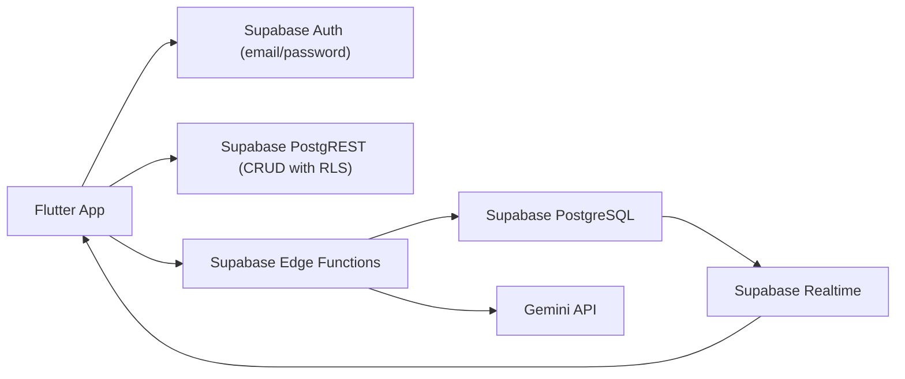

# PHASE 8 – TECHNICAL ARCHITECTURE & BACKEND DESIGN

## 0) Document Metadata
- Product: SoulNum (Vietnam, Numerology-first)
- Last Updated: 2026-03-02
- Target Client: Flutter mobile app
- Backend: Supabase (Auth, PostgreSQL, Realtime, Edge Functions)
- AI Layer: Google Gemini (server-side only via Supabase Edge Functions)
- Supabase Project ID: `aauidavuipscnbmdhale`
- Architecture source-of-truth in repo:
  - `supabase/migrations/20260228211000_phase9_soulnum_backend.sql`
  - `supabase/migrations/20260301102000_phase10_gemini_context_warehouse.sql`
  - `supabase/functions/**`

---

## 1) System Architecture

### 1.1 Architecture Goals
1. AI-first but cost-controlled architecture for numerology insights.
2. Persistent memory across sessions/features (not stateless per request).
3. Strict server-side execution for Gemini API calls.
4. Strong ownership isolation via Supabase Auth + RLS.
5. Long-term maintainability via prompt versioning and context warehouse.

### 1.2 High-Level Components

```mermaid
flowchart LR
  FE["Flutter App"] --> AUTH["Supabase Auth (email/password)"]
  FE --> DBQ["Supabase PostgREST (CRUD with RLS)"]
  FE --> FN["Supabase Edge Functions"]
  FN --> DB["Supabase PostgreSQL"]
  FN --> GEM["Gemini API"]
  DB --> RT["Supabase Realtime"]
  RT --> FE
```

### 1.3 Client Communication Lifecycle
1. User signs in on Flutter via Supabase Auth (email/password).
2. Flutter performs standard CRUD directly to tables (profiles, history views) under RLS.
3. AI and business-critical operations are executed through Edge Functions.
4. Edge Function validates auth, loads context, resolves prompt version, calls Gemini, validates output, persists artifacts.
5. Client receives normalized JSON and renders UI.

### 1.4 Supabase Responsibilities
1. AuthN/AuthZ with JWT session lifecycle.
2. PostgreSQL as persistent store for profiles/readings/memory/entitlements.
3. Edge Functions as secure AI gateway and business-rules layer.
4. Realtime for optional reactive refresh.

### 1.5 Edge Function AI Gateway Responsibilities
1. Never expose Gemini key to client.
2. Resolve active prompt by `feature_key`.
3. Build 2-layer context:
   - Global context (`global_context_blocks`)
   - User/profile context (`profile_numerology_baselines`, `ai_context_memory`, recent readings/messages)
4. Enforce strict JSON output contract:
   - prompt-level `response_schema`
   - server-side schema validation in `_shared/gemini.ts`
5. Persist AI outputs for reuse and audit.

### 1.6 AI Generation Lifecycle
1. Validate JWT + ownership.
2. Load profile and deterministic numerology baseline.
3. Load global context blocks and active memory.
4. Resolve active prompt version.
5. Build stable cache key (`input_hash`) using normalized identity/context version.
6. Cache hit: return persisted output.
7. Cache miss: invoke Gemini (`gemini-2.5-flash`).
8. Validate JSON output against schema.
9. Persist to `ai_generated_contents`, `user_readings`, `ai_context_memory`.

---

## 2) Backend Logical Modules

### 2.1 Authentication Module
- Components: `auth.users`, `public.users`, auth triggers.
- Responsibility: user identity, app-level metadata sync (`email`, `auth_method`), session-backed access.
- Interaction: every user-owned read/write depends on `auth.uid()` and RLS.

### 2.2 Profile Management Module
- Components: `user_profiles`, `profile_deletion_audits`, delete edge function.
- Responsibility: multi-profile management, active profile selection, permanent profile deletion cascade.
- Interaction: all numerology features require valid owned profile.

### 2.3 Prompt Orchestration Module
- Components: `prompt_versions`, `_shared/prompt.ts`.
- Responsibility: active prompt lookup, version traceability, schema-bound output contract.
- Interaction: every AI generation row references `prompt_version_id`.

### 2.4 Context Warehouse Module
- Components: `global_context_blocks`, `profile_numerology_baselines`, `ai_context_memory`, `_shared/context.ts`, `_shared/baseline.ts`.
- Responsibility: assemble global + profile-specific context for prompt payload.
- Interaction: shared across reading and chat functions.

### 2.5 Numerology Generation Module
- Components: `fn_get_or_generate_reading`, `ai_generated_contents`, `user_readings`.
- Responsibility: generate/cache/retrieve readings across feature keys.
- Interaction: reads prompt/context, persists output and memory facts.

### 2.6 Chatbot Module
- Components: `fn_chat_with_guide`, `ai_chat_sessions`, `ai_chat_messages`, `ai_usage_ledger`.
- Responsibility: VIP-gated chat, quota enforcement, conversation persistence.
- Interaction: uses same context warehouse + prompt schema enforcement.

### 2.7 Monetization & Entitlement Module
- Components: `subscriptions`, `subscription_events`, `subscription_entitlements`, `fn_sync_subscription`.
- Responsibility: subscription verification/sync and runtime entitlement snapshot.
- Interaction: drives VIP access and limits.

### 2.8 Daily Biorhythm Gate Module
- Components: `rewarded_ad_events`, `daily_biorhythm_unlocks`, `fn_unlock_daily_biorhythm`.
- Responsibility: ad-gate for free users, direct unlock for VIP.

### 2.9 Maintenance & Observability Module
- Components: `fn_compact_context_memory`, app logs, function logs.
- Responsibility: memory compaction and operational visibility.

---

## 3) Database Design (Persistent AI Memory)

## 3.1 Design Principles
1. Ownership-rooted schema (`users.id`) for strict data isolation.
2. AI artifact, user-facing history, and reusable memory are separated but linked.
3. Deterministic baseline is cached and reused to reduce model drift/cost.
4. Prompt and context versioning are first-class for reproducibility.

## 3.2 Tables (Current)
1. `users`
2. `user_profiles`
3. `prompt_versions`
4. `global_context_blocks`
5. `profile_numerology_baselines`
6. `ai_generated_contents`
7. `user_readings`
8. `ai_context_memory`
9. `ai_chat_sessions`
10. `ai_chat_messages`
11. `ai_usage_ledger`
12. `subscriptions`
13. `subscription_entitlements`
14. `subscription_events`
15. `rewarded_ad_events`
16. `daily_biorhythm_unlocks`
17. `profile_deletion_audits`

## 3.3 Detailed Table Specifications

### 3.3.1 `users`
- Feature supported: authentication bootstrap, ownership root.
- Purpose: app-level user metadata mirror from `auth.users`.
- Why exists: avoid coupling all app queries to `auth` schema.
- Data ownership: self-owned (`id = auth.uid()`).
- Relationships: parent of most user-owned tables.
- Example data: `{id, email, auth_method: "email_password", locale: "vi-VN"}`.
- Future extension: consent flags, notification prefs.

### 3.3.2 `user_profiles`
- Feature supported: all numerology features + compatibility.
- Purpose: store profile input (`full_name`, `birth_date`, relation, active flag).
- Why exists: a user can manage multiple profiles.
- Data ownership: `owner_user_id`.
- Relationships: referenced by readings/chat/memory/unlocks.
- Example data: `{owner_user_id, full_name, birth_date, is_active}`.
- Future extension: tags/archival state.

### 3.3.3 `prompt_versions`
- Feature supported: AI prompt governance.
- Purpose: runtime prompt templates and response schemas by feature/version.
- Why exists: safe rollout/rollback and auditability.
- Data ownership: platform/service role.
- Relationships: FK from `ai_generated_contents.prompt_version_id`.
- Example data: `{feature_key: "core_numbers", version: "v1.0.0", is_active: true}`.
- Future extension: model routing per tier/feature.

### 3.3.4 `global_context_blocks`
- Feature supported: context warehouse global + feature level.
- Purpose: centralized reusable numerology guidance blocks.
- Why exists: stable domain context across prompts.
- Data ownership: platform/service role.
- Relationships: loaded by edge functions (no direct FK dependency).
- Example data: `{scope: "feature", feature_key: "forecast_month", content: {...}}`.
- Future extension: locale expansion and multi-version context experiments.

### 3.3.5 `profile_numerology_baselines`
- Feature supported: all readings + chatbot personalization.
- Purpose: cache deterministic baseline from profile input.
- Why exists: reduce repeated computation and AI drift.
- Data ownership: user-owned (`user_id`).
- Relationships: FK to `users`, `user_profiles`.
- Example data: `{calc_version, input_hash, baseline_json}`.
- Future extension: multiple calculation engines via `calc_version`.

### 3.3.6 `ai_generated_contents`
- Feature supported: all AI outputs.
- Purpose: persist model outputs (`output_json`, tokens, prompt linkage).
- Why exists: cache + audit + replay.
- Data ownership: user-owned.
- Relationships: linked to readings and chat messages.
- Example data: `{feature_key, input_hash, prompt_version_id, output_json}`.
- Future extension: moderation flags, latency metrics, cost attribution.

### 3.3.7 `user_readings`
- Feature supported: readings history and retrieval.
- Purpose: user-facing reading timeline snapshots.
- Why exists: immutable-like history even when cache reused.
- Data ownership: user-owned.
- Relationships: references `user_profiles`, optional `ai_generated_contents`.
- Example data: `{feature_key: "core_numbers", source_type: "cached"}`.
- Future extension: bookmarking/favoriting.

### 3.3.8 `ai_context_memory`
- Feature supported: cross-feature personalization.
- Purpose: normalized memory facts extracted from AI output.
- Why exists: reusable long-term context graph.
- Data ownership: user/profile-owned.
- Relationships: optional source links to content/reading.
- Example data: `{memory_type: "pattern", memory_key: "...", confidence_score: 0.72}`.
- Future extension: decay score, pinning, explicit user-editable memories.

### 3.3.9 `ai_chat_sessions`
- Feature supported: VIP chatbot conversations.
- Purpose: conversation container per user/profile.
- Why exists: scope and lifecycle for message history.
- Data ownership: user-owned.
- Relationships: parent of `ai_chat_messages`.
- Example data: `{status: "active", started_at}`.
- Future extension: session titles and archival states.

### 3.3.10 `ai_chat_messages`
- Feature supported: chatbot transcript.
- Purpose: store user/assistant turns and optional AI content linkage.
- Why exists: continuity, auditability, and support debugging.
- Data ownership: user-owned.
- Relationships: FK `session_id`, optional FK `ai_content_id`.
- Example data: `{role: "assistant", content: "..."}`.
- Future extension: moderation outcome per turn.

### 3.3.11 `ai_usage_ledger`
- Feature supported: monthly VIP chatbot hard-limit.
- Purpose: usage counters and blocked attempts.
- Why exists: deterministic quota enforcement.
- Data ownership: user-owned (writes typically server-controlled).
- Relationships: keyed by user/month/type.
- Example data: `{usage_month, usage_type: "chat_turn", used_count}`.
- Future extension: per-feature pricing/cost dashboards.

### 3.3.12 `subscriptions`
- Feature supported: subscription lifecycle.
- Purpose: store provider transaction contract snapshots.
- Why exists: entitlement source truth.
- Data ownership: user-owned.
- Relationships: parent for `subscription_events`.
- Example data: `{provider: "google", plan_code: "vip_pro_monthly"}`.
- Future extension: grace/cancel reasons.

### 3.3.13 `subscription_entitlements`
- Feature supported: runtime access gating.
- Purpose: denormalized active entitlement status.
- Why exists: fast gate checks without expensive joins.
- Data ownership: user-owned row keyed by user_id.
- Relationships: 1:1 with `users`.
- Example data: `{is_vip_pro, chatbot_monthly_limit, profile_limit}`.
- Future extension: per-feature entitlements.

### 3.3.14 `subscription_events`
- Feature supported: billing audit.
- Purpose: immutable event log from sync/verification updates.
- Why exists: troubleshooting and compliance trace.
- Data ownership: user-owned.
- Relationships: optional link to `subscriptions`.
- Example data: `{event_type: "active", raw_payload}`.
- Future extension: webhook reconciliation IDs.

### 3.3.15 `rewarded_ad_events`
- Feature supported: free ad-gated daily cycle.
- Purpose: proof record for rewarded-ad completion.
- Why exists: unlock validation trace.
- Data ownership: user/profile-owned.
- Relationships: referenced by `daily_biorhythm_unlocks.ad_event_id`.
- Example data: `{placement: "daily_cycle_unlock", status: "completed"}`.
- Future extension: anti-fraud scoring.

### 3.3.16 `daily_biorhythm_unlocks`
- Feature supported: daily biorhythm access control.
- Purpose: one unlock row per user/profile/day.
- Why exists: idempotent gating and quick check.
- Data ownership: user/profile-owned.
- Relationships: optional link to rewarded ad event.
- Example data: `{unlock_date, unlock_method: "vip"|"rewarded_ad"}`.
- Future extension: timezone-specific unlock windows.

### 3.3.17 `profile_deletion_audits`
- Feature supported: in-app permanent delete.
- Purpose: non-PII deletion audit proof.
- Why exists: accountability after hard deletion operations.
- Data ownership: user-owned audit trail.
- Relationships: linked by `user_id` and `deleted_profile_id` value.
- Example data: `{deleted_profile_id, reason: "user_requested"}`.
- Future extension: operator/action metadata for support flows.

---

## 4) AI Invocation & Edge Function Design

## 4.1 Canonical Function Inventory (Repo)
1. `fn_get_or_generate_reading`
2. `fn_chat_with_guide`
3. `fn_unlock_daily_biorhythm`
4. `fn_sync_subscription`
5. `fn_get_history_feed`
6. `fn_delete_profile_permanently`
7. `fn_compact_context_memory` (cron/internal)

### 4.1.1 `fn_get_or_generate_reading`
- Triggering action: user opens a reading feature (core numbers, psych matrix, forecast, etc.).
- Purpose: cache-aware generate/retrieve reading.
- Input payload: `profile_id`, `feature_key`, optional `target_period`, `target_date`, `secondary_profile_id`, `force_refresh`.
- Context retrieval:
  - owned profile(s)
  - deterministic baseline(s)
  - active prompt + schema
  - global context blocks
  - active memory facts
  - recent readings
- Gemini prompt usage: prompt from `prompt_versions` + context payload.
- Persistence:
  - cache hit: inserts `user_readings` (`source_type: cached`)
  - cache miss: inserts `ai_generated_contents`, `user_readings`, upserts `ai_context_memory`
- Response: `{reading_id, feature_key, from_cache, result, generated_at, prompt_version, context_version}`.

### 4.1.2 `fn_chat_with_guide`
- Triggering action: VIP user sends chatbot message.
- Purpose: contextual AI assistant with quota control.
- Input payload: `profile_id`, optional `session_id`, `message`.
- Context retrieval:
  - entitlement + monthly quota
  - profile baseline
  - global context blocks (chat)
  - active memory
  - recent readings/messages
- Gemini prompt usage: `chat_assistant` active prompt and schema.
- Persistence:
  - chat session/messages
  - AI artifact (`ai_generated_contents`)
  - memory facts (`ai_context_memory`)
  - usage increment (`ai_usage_ledger` via RPC)
- Response: `{session_id, reply, remaining_quota, quota_limit, quota_exhausted, prompt_version, context_version}`.

### 4.1.3 `fn_unlock_daily_biorhythm`
- Triggering action: user tries to open daily biorhythm.
- Purpose: enforce VIP or rewarded-ad unlock.
- Input payload: `profile_id`, optional `unlock_date`, optional `ad_proof`.
- Context retrieval: entitlement + existing unlock state.
- Persistence: optional `rewarded_ad_events` + `daily_biorhythm_unlocks`.
- Response: unlock status and method.

### 4.1.4 `fn_sync_subscription`
- Triggering action: user activates/restores subscription.
- Purpose: verify purchase and update entitlements.
- Input payload: `provider`, `receipt_or_purchase_token`, `plan_code`.
- Context retrieval: current subscription rows for conflict handling.
- Persistence: `subscriptions`, `subscription_events`, `subscription_entitlements`.
- Response: normalized entitlement snapshot.

### 4.1.5 `fn_get_history_feed`
- Triggering action: user opens analysis history.
- Purpose: paginated reading history retrieval.
- Input payload: optional `profile_id`, `cursor`, `limit`.
- Context retrieval: `user_readings` + linked `ai_generated_contents`.
- Persistence: read-only.
- Response: `{items, next_cursor}`.

### 4.1.6 `fn_delete_profile_permanently`
- Triggering action: user confirms profile deletion.
- Purpose: hard-delete profile and related data.
- Input payload: `profile_id`, `confirm=true`.
- Context retrieval: ownership + current active profile.
- Persistence: cascade-like deletes + audit row + active-profile fallback.
- Response: deletion summary.

### 4.1.7 `fn_compact_context_memory`
- Triggering action: scheduled cron.
- Purpose: deactivate stale memory facts.
- Input payload: optional `batch_size`.
- Context retrieval: stale memory candidate query.
- Persistence: marks memories inactive.
- Response: compact metrics.

---

## 5) Data Flow Mapping

## 5.1 Standard CRUD Flow (Profiles)
User Action -> Flutter CRUD call -> RLS filter by `auth.uid()` -> DB write/read -> UI refresh.

## 5.2 Reading AI Flow
1. User opens reading.
2. Flutter calls `fn_get_or_generate_reading`.
3. Function authenticates user and validates profile ownership.
4. Function loads prompt + global context + baseline + memory + recent readings.
5. Function computes `input_hash`.
6. Cache hit -> save reading history from cached artifact -> return.
7. Cache miss -> Gemini generate -> schema validate -> persist artifact/history/memory -> return.

## 5.3 Chat AI Flow
1. User sends message in AI Chatbot.
2. Flutter calls `fn_chat_with_guide`.
3. Function authenticates + checks VIP entitlement and monthly quota.
4. Function loads context and prompt.
5. Gemini generates reply.
6. Function increments quota via atomic RPC.
7. Function persists AI artifact/message/memory.
8. Function returns reply + remaining quota.

## 5.4 Cross-Feature Memory Reuse
- `ai_context_memory` entries from readings and chat are reused in both flows.
- Deterministic baseline (`profile_numerology_baselines`) is shared across all features.
- `context_version` combines global context + baseline versions for traceability.

---

## 6) Scalability & Performance Strategy

1. Artifact cache: `ai_generated_contents` keyed by `(feature_key, prompt_version_id, input_hash)`.
2. Deterministic baseline cache: `profile_numerology_baselines` reused for every profile request.
3. PromptOps runtime switching: activate/deactivate prompt versions without app release.
4. Indexed retrieval paths:
   - `user_id`
   - `feature_key`
   - `created_at` / `generated_at`
5. Memory growth control: scheduled compaction of stale `ai_context_memory`.
6. Cost control:
   - VIP monthly hard-limit via `ai_usage_ledger`
   - cache-first generation policy.

---

## 7) Security Strategy

1. Supabase Auth + JWT required for all user-triggered protected functions.
2. RLS enabled on all user-owned tables.
3. Gemini keys in server secrets only:
   - `GEMINI_API_KEY`
   - optional `GEMINI_API_KEY_FALLBACK`
4. Edge Functions use service role internally but enforce ownership checks before data access.
5. Prompt injection mitigation:
   - prompt templates server-side
   - deterministic baseline/context assembly
   - strict JSON schema validation server-side.
6. Abuse prevention:
   - chat quota enforcement (`increment_ai_usage_if_available`)
   - ad-gate verification for free daily unlock path.
7. Cron endpoint isolation:
   - `fn_compact_context_memory` protected by `x-cron-secret`.

---

## 8) Constraints & Assumptions (Current)

1. MVP locale: Vietnamese (`vi-VN`).
2. Numerology outputs are advisory, not deterministic life outcomes.
3. Core numerology readings are free; chatbot is VIP-limited.
4. Gemini model in seeded prompts: `gemini-2.5-flash`.
5. Backend schema is fixed by existing migrations; no redesign in this phase.

---

## 9) Known Drift / Reconciliation Notes

1. Flutter currently references three function slugs with `_open` suffix:
   - `fn_chat_with_guide_open`
   - `fn_unlock_daily_biorhythm_open`
   - `fn_sync_subscription_open`
2. Repository function source and `supabase/config.toml` define canonical slugs without `_open` and `verify_jwt = true`.
3. Action required for consistency:
   - either deploy `_open` aliases and document them in source control,
   - or update Flutter constants to canonical function names.
4. This document describes canonical architecture; runtime aliases must be explicitly tracked in deployment docs.

---

## 10) Operational Environment Variables

Required for backend runtime:
- `SUPABASE_URL`
- `SUPABASE_ANON_KEY`
- `SUPABASE_SERVICE_ROLE_KEY`
- `GEMINI_API_KEY`

Optional:
- `GEMINI_API_KEY_FALLBACK`
- `VIP_CHATBOT_MONTHLY_LIMIT`
- `BILLING_VERIFY_URL`
- `CRON_SECRET`

