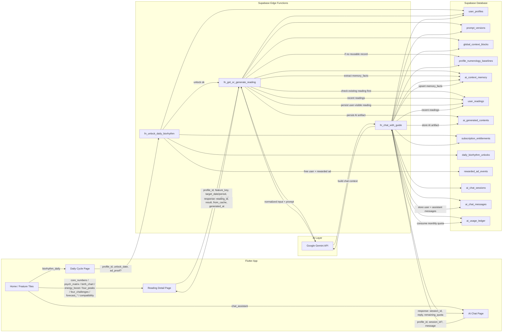

# SoulNum AI Feature Flow

## Overview

Sơ đồ dưới đây mô tả luồng từ Flutter FE -> Supabase Edge Functions -> Gemini -> Database tables cho các chức năng AI chính:

- Reading AI
- Daily Cycle unlock + reading
- AI Chatbot

## Mermaid

## Reading Notes

- `user_readings` là bảng lookup đầu tiên cho Reading AI.
- Nếu đã có record phù hợp theo scope, backend trả luôn từ `user_readings`.
- Nếu chưa có, backend mới load baseline + prompt + context rồi gọi Gemini.
- `ai_generated_contents` lưu artifact AI gốc.
- `user_readings` lưu bản business record mà app sẽ fetch lại.
- `ai_context_memory` lưu các `memory_facts` rút gọn để dùng lại ở reading/chat sau.

## Daily Cycle Notes

- `biorhythm_daily` có 2 bước:
  1. unlock qua `fn_unlock_daily_biorhythm`
  2. reading qua `fn_get_or_generate_reading`
- VIP user: ghi `daily_biorhythm_unlocks` với `unlock_method = vip`
- Free user: ghi `rewarded_ad_events`, rồi ghi `daily_biorhythm_unlocks`

## Chat Notes

- Chat không ghi vào `user_readings`.
- Chat dùng:
  - `ai_chat_sessions`
  - `ai_chat_messages`
  - `ai_generated_contents`
  - `ai_context_memory`
  - `ai_usage_ledger`
- Baseline deterministic vẫn được dùng để chatbot trả lời có nền tảng numerology ổn định.
